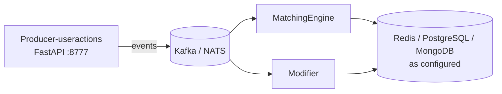

# order matching platform

Monorepo for an event-driven trading pipeline: ingest user actions, apply live order modifications, and run the matching engine (limit, stop, liquidation checks, and related consumers).

## Overview

| Component | Role |
|-----------|------|
| **useractions** | HTTP API (FastAPI) that accepts user actions and publishes them into the messaging layer for downstream processing. |
| **Modifier** | Consumer service that applies real-time order modifications and keeps state in sync with the rest of the stack. |
| **MatchingEngine** | Core matching and order lifecycle workers: user-action consumption, limit/stop order handling, and scheduled checks (limits, stops, liquidations). |

Together these services implement the path from **client action → stream → modification → matching and risk checks**.

## Architecture (high level)



## Tech stack

- **Runtime:** Python 3 (see each service’s `requirements.txt` / Docker image)
- **API:** FastAPI, Uvicorn
- **Messaging:** Apache Kafka (`kafka-python`), NATS (`nats-py`)
- **Data stores:** Redis, PostgreSQL (`psycopg2-binary`), MongoDB (`pymongo`) — usage depends on service configuration
- **Ops:** Docker & Docker Compose per service; optional Grafana Loki logging (configured in matching-engine compose)

## Repository layout

```
UAT-MatchingEngine/
├── useractions/     # User-action producer API + Docker
├── Modifier/        # Modification consumer + Docker
└── MatchingEngine/  # Matching consumers, producers, NATS pipeline, Docker
```

## Getting started

Each service is built and run independently with its own `.env` and Compose file.

1. **useractions**

   ```bash
   cd Producer-useractions
   # Create .env with your Kafka/NATS, DB, and API settings
   docker compose up --build
   ```

   The API listens on port **8777** by default (see `main.py`).

2. **Modifier**

   ```bash
   cd Modifier
   # Create .env
   docker compose up --build
   ```

3. **MatchingEngine**

   ```bash
   cd MatchingEngine
   # Create .env
   docker compose up --build
   ```

   This stack defines multiple containers (e.g. user-action, limit-order, stop-order, and check-* workers). Adjust or scale services to match your environment.

> **Note:** Connection strings, topics, subjects, and credentials are environment-specific. Copy from your internal docs or existing deployment; do not commit secrets.

## Development

- Install dependencies locally from each folder’s `requirements.txt` (or use the Docker workflows above).
- Follow the same `.env` variables you use in containers so local runs match deployed behavior.

## Contributing

Use focused changes per service, keep configuration out of version control, and align new consumers/producers with the existing Kafka/NATS patterns in each module.
